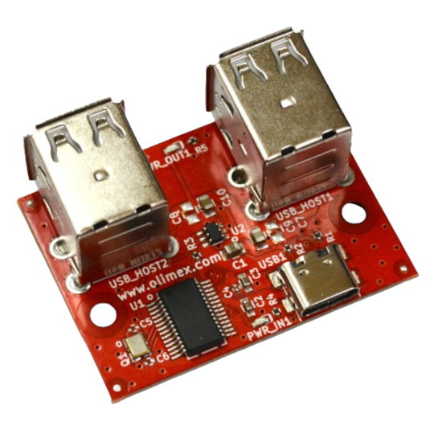

# USB-NeoHub
USB 1.1 and USB 2.0 compliant hub compatible with RP2040 PICO USB and TinyUSB allowing keyboard, USB Flash and other peripherals to be used together

## Features

* USB 1.1 and USB 2.0 compatible
* USB-C input
* USB-A x4 output
* Input power status LED
* Output power status LED
* current protection
* Industrial grade temperature range: -40+85℃
* Dimensions 46x34 mm

## Licenses

* Hardware is released under CERN Open Hardware Licence Version 2 - Strongly Reciprocal, all silkscreen credits to Olimex should remain;
* Software is released under GPL3 Licensee
* Documentation is released under CC BY-SA 4.0
